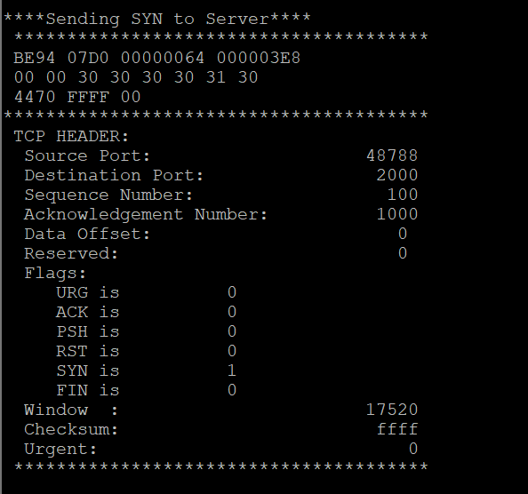
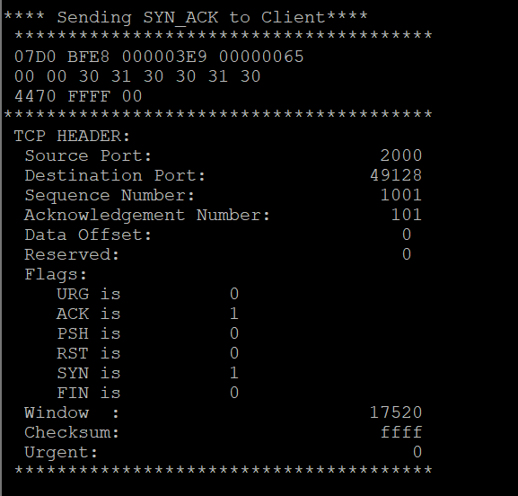
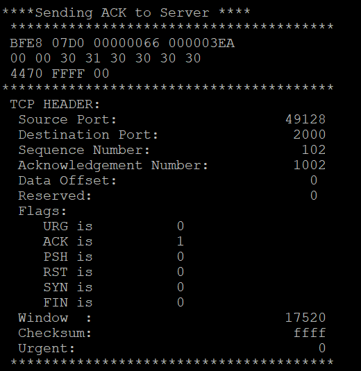

# Socket programming in C
# TCP-3Way-Handshake-Simulator
## Overview
The TCP client/server simulator program is written in C to represent how a TCP 3-way handshake works in practice. 

The server program initiates a TCP connection and listens to the client's connection request. The client sends an SYN header request to the server, to which the server replies with an SYN/ACK header. Finally, the client responds with an ACK header to indicate a successful TCP connection. 

## Installation

<mark>Note:</mark> Verify that the git and C compiler is installed on your local machine.

Clone the repository to your local computer
> git clone https://github.com/ujjwalrg/TCP-3Way-Handshake-Simulator.git

Goto Server/ and run below commands, \
> <mark>make "enter"</mark> (this will compile the c file and create the server executable)\
<mark>./server "port" </mark>("port" is an integer that the server will use to bind the TCP socket)

Goto Client/ and run below commands \
> <mark>make "enter"</mark> (this will compile the c file and create the client executable) \
<mark>./client "port"</mark> ("port" takes the same value that you've assigned to the server) 

And Voila, now you have a TCP server and client communicating with each other and simulating the 3-way-handshake process.

## TCP 3-way Handshake Process

1) The client sends s SYN message to the server.
    

2) The server receives the SYN message, modifies the header, and sends the SYN+ACK message.
     
   
3) The client receives the SYN+ACK message, modifies the header, and responds with ACK message.
    

4) TCP connection terminates.

## Copyright
&copy; 2022 TCP handshake by Ujjwal, No rights reserved  

